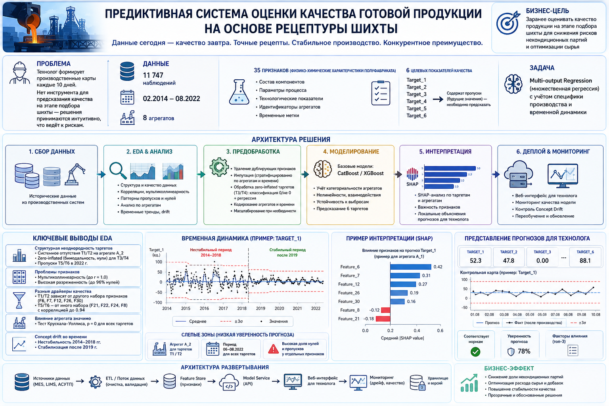
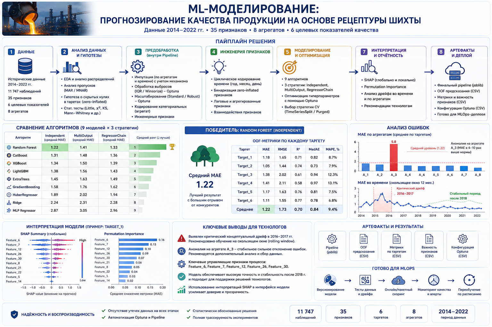

# ML-in-metallurgy

## 🏭 Предиктивная аналитика качества металлургической продукции

Данный репозиторий содержит комплексное решение для прогнозирования ключевых показателей качества готовой металлургической продукции на основе рецептуры шихты и исторических параметров производственного процесса.
Решение разработано с учетом специфики реального производства (на примере процессов **НЛМК**) и охватывает полный жизненный цикл **Data Science** проекта: от глубокого разведочного анализа (**EDA**) и очистки данных до создания интерпретируемого Machine Learning пайплайна и подготовки к **MLOps**-внедрению.

## 📂 Структура проекта
- 📊 `EDA.ipynb `— Глубокий разведочный анализ данных. Включает анализ пропусков (`MAR/MNAR`), выявление zero-inflated признаков, статистическое тестирование различий между агрегатами (тест **Крускала-Уоллиса**), анализ корреляций и контрольные карты (`Control Charts`) для оценки стабильности процесса.

- 🤖 `ML.ipynb` — Построение и обучение **ML**-моделей. Содержит кастомные трансформеры для `sklearn.Pipeline`, сравнение алгоритмов (от линейных моделей до градиентного бустинга), оценку через `Out-of-Fold (OOF)` предсказания, анализ концептуального дрейфа и интерпретацию через `SHAP`.

## 📊 Описание данных
- **Объем выборки:** ~11 700 наблюдений.
- **Признаки (Features):** 35 физико-химических характеристик шихты/полуфабриката (`Feature_1` ... `Feature_35`).
- **Целевые переменные (Targets):** 6 ключевых метрик качества готового продукта (`Target_1` ... `Target_6`).
- **Мета-данные:** Временные метки (`DATE`) и идентификаторы производственных агрегатов (`Aggregate`).
- **Особенность:** Задача формулируется как `Multi-output Regression`. Данные содержат структурные пропуски в таргетах и избыток нулевых значений (`zero-inflation`).

## 🔍 EDA и ключевые выводы

1. **Природа пропусков:** Пропуски в целевых переменных (до 31% для `Target_3` и `Target_4`) не являются случайными (`MCAR`). Статистические тесты подтверждают их зависимость от агрегата и времени (`MAR/MNAR`), что требует специфических стратегий импутации или двухэтапного моделирования.
2. **Zero-Inflation:** Обнаружены признаки и таргеты с аномально высоким процентом нулей (`до 96%`). Стандартная регрессия на таких данных неэффективна.
3. **Специфика агрегатов:** Тест `Крускала-Уоллиса` подтверждает статистически значимые различия в целевых показателях между агрегатами. Например, агрегат `A_3` демонстрирует аномальную ошибку прогноза, что указывает на специфику его работы или проблемы с измерениями.
4. **Концептуальный дрейф:** Зафиксирован критический концептуальный дрейф в период `2016–2017` годов, после которого процесс стабилизировался. Это диктует необходимость использования скользящего окна (`sliding window`) при обучении модели.

## 🤖 Machine Learning Пайплайн

### 1. **Предобработка данных (Custom Pipeline)**.
Для предотвращения утечек данных и обеспечения воспроизводимости разработан кастомный `sklearn.Pipeline`:
- **Обработка пропусков**: `IterativeImputer (MICE)` и `KNNImputer` с учетом природы пропусков.
- **Zero-Inflation**: Создание бинарных индикаторов ненулевых значений для признаков с избытком нулей.
- **Кодирование**: `TargetEncoder` / `OneHotEncoder` для категориального признака `Aggregate`.
- **Масштабирование и выбросы**: `RobustScaler` и кастомный `OutlierHandler` (`winsorization/clip`).

### 2. **Моделирование**.

Решение задачи множественной регрессии. Были протестированы:
- **Линейные модели:** Ridge, Lasso, ElasticNet.
- **Ансамбли деревьев:** RandomForest, ExtraTrees.
- **Градиентный бустинг:** HistGradientBoosting, LightGBM, XGBoost, CatBoost.
- **Нейронные сети:** MLPRegressor.

**🏆 Лучшая модель:** Связка `RandomForest` + стратегия `Independent` (независимое обучение таргетов через кастомный `SafeMultiOutputRegressor`, корректно обрабатывающий `NaN` в целевых переменных).

### 3. Оценка качества

Оценка производилась на честных `Out-of-Fold (OOF)` предсказаниях с использованием метрик:
- **MAE** (Mean Absolute Error)
- **RMSE** (Root Mean Squared Error)
- **R²** (Coefficient of Determination)
- **MedAE** (Median Absolute Error)

### 🧠 Интерпретируемость и Бизнес-ценность

Металлургия не допускает использования «черных ящиков». Для обеспечения прозрачности модели используются:
- **SHAP (SHapley Additive exPlanations):** Глобальная и локальная интерпретация вклада каждого компонента шихты в итоговое качество.
- **Permutation Importance:** Ранжирование признаков для понимания физических драйверов процесса.

### Бизнес-применение:

Технолог получает инструмент, который позволяет до формирования производственной карты оценить риски и спрогнозировать итоговое качество, скорректировав рецептуру шихты. Это снижает риск выпуска некондиционной продукции и экономит ресурсы.

### ⚙️ Подготовка к Production (MLOps)

В ноутбуках заложены архитектурные решения для деплоя:
1. **Сериализация**: Финальный пайплайн и артефакты (метрики, важность признаков) сохраняются в `joblib` и `CSV`.
2. **Мониторинг дрейфа**: Реализован анализ ошибок во времени. В продакшен-версии рекомендуется настроить алертинг на Concept Drift и Data Drift.
3. **Регулярное дообучение**: Из-за выявленного дрейфа модель должна обучаться на скользящем окне (например, последние 2-3 года), игнорируя устаревшие исторические данные.

### 🛠 Технологический стек
- **Язык**: Python 3.10+
- **Анализ данных:** Pandas, NumPy
- **Визуализация**: Matplotlib, Seaborn, Missingno
- **Machine Learning:** Scikit-learn, XGBoost, LightGBM, CatBoost, Optuna
- **Интерпретируемость**: SHAP
- **Статистика**: SciPy (тесты Крускала-Уоллиса, Манна-Уитни, Колмогорова-Смирнова)
